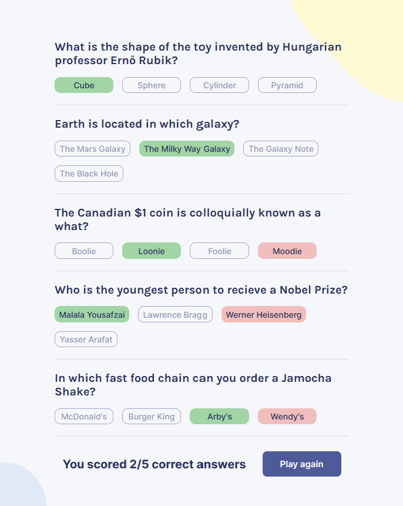

# Quizzical - A Quiz with five random questions

## Description
This app calls the [Open Trivia Database](https://opentdb.com/) and fetches five random questions.

The user selects answers and clicks on "Check answers" for evaluation.

At a score of 5/5 a special graphical firework will appear on the screen!

 

## Technologies
- HTML
- CSS
- JavaScript
- TypeScript
- React

## Live link
Quizzical is deployed here:
[https://toms-quizzical.netlify.app](https://toms-quizzical.netlify.app)

Please feel free to click around and explore!
